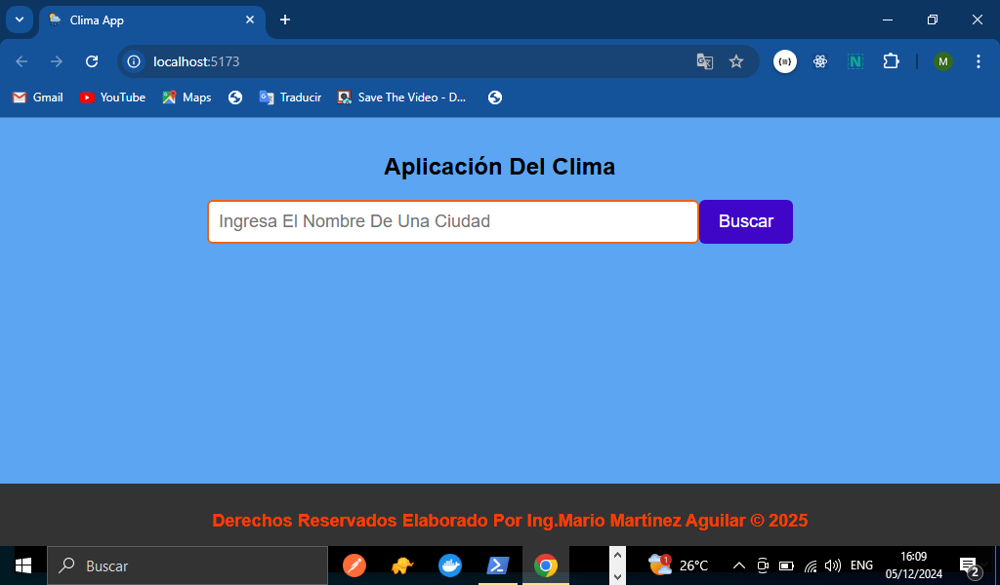
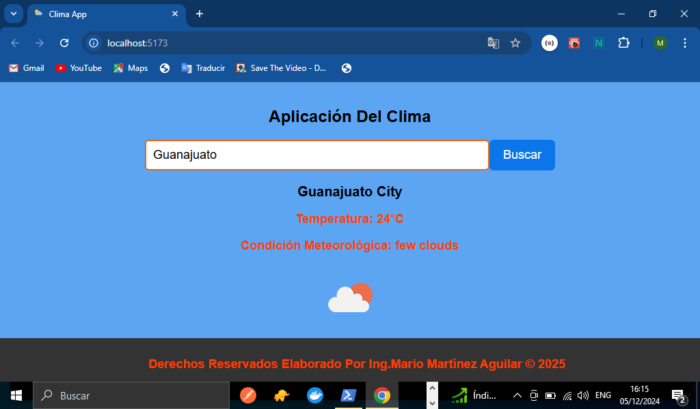
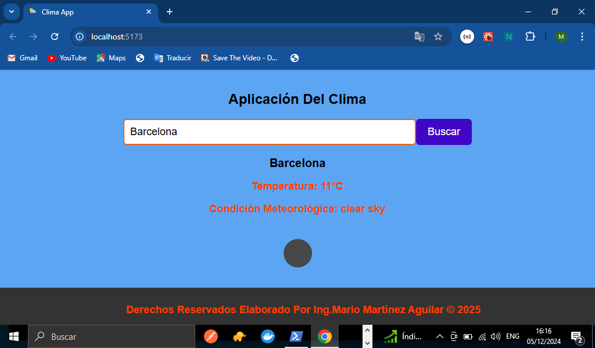

# TITULO DEL PROYECTO    

**Aplicación Web Del Clima con React**

# DESCRIPCIÓN DEL PROYECTO (Pagina web del clima)
**En esta aplicación web que elaboramos con React podremos consultar el clima de cualquier país que nosotros busquemos a través de la aplicación, en este proyecto logramos consumir una API para poder traer la información del clima con otras características que nos da la API y poderla mostrar en el Front-end usando React y que el usuario pueda hacer uso de la aplicación web a través de un buscador para que busque el país o cuidad que el desee a continuación se explicara más a fondo, con partes de código y algunas explicaciones de cómo se realizó esta aplicación:**

## VISTA PREVIA DE NUESTRO PROYECTO YA FUNCIONANDO, CUANDO ENTRAMOS A LA APLICACION:


## VISTA PREVIA DE LA APLICACION CUANDO EL USUARIO BUSCA UNA CIUDAD EN PARTICULAR:


## VISTA DE NUESTRA APLICACION WEB CUNADO BUSCAMOS UNA CUIDAD EN OTRA PARTE DEL MUNDO:


## ESTRUCTURA WEB HTML DEL BUSCADOR(INPUT Y BOTON BUSCAR)
**En la parte del HTML lo que es el buscador de la ciudad para ver el clima solamente creamos un componente llamado WeatherApp.jsx donde tendremos toda la estructura de la aplicación como podemos ver el return del componente contamos con un form que es el input donde el usuario escribe lo que quiere buscar y al final un botón que dice buscar cómo se puede ver a continuación:**

```Jsx
        <h1>Aplicación Del Clima</h1>
        <form onSubmit={hadleSubmit}>
            <input 
            type="text"
            placeholder="Ingresa El Nombre De Una Ciudad"
            value={ciudad}
            onChange = {handleCambioCiudad} 
            />
            <button type="submit">Buscar</button>
        </form>
```
## ESTILIZADO CSS DEL INPUT Y DEL BOTON
**Generamos un archivo WeatherStyles.css dentro de nuestra carpeta Styles para poder generar los estilos de nuestra página web, A continuación en el siguiente fragmento de código CSS podemos ver los estilos que aplicamos a nuestro sitio web. Puedes consultar los estilos completos en nuestro archivo CSS que creamos dentro de la carpeta styles de nuestro Repositorio**
```CSS
    h1 {
        font-size: 24px;
        margin-bottom: 20px;
    }
  
    form {
        display: flex;
        margin-bottom: 20px;
    }
  
    input[type="text"] {
        flex: 1;
        padding: 10px;
        border: 2px solid rgb(237, 98, 18);
        border-radius: 6px;
        font-size: large;
    }
    
    button {
        padding: 10px 20px;
        background-color: #4006c7;
        color: #fff;
        border: none;
        border-radius: 6px;
        cursor: pointer;
        font-size: large
    }
    
    button:hover {
        background-color: #0b76e9;
    }
```
## USO DEL USESTATE EN REACT(useState)
**Para poder llevar el control de la ciudad que el usuario ingrese y poder manejar el valor del input hicimos uso del Hook useState de React que tiene como la ciudad y el valor que se va a setear con setCiudad como se muestra a continuación(Todo el código en nuestro archivo WeatherApp.jsx del repositorio):**
```Jsx
    import { useState } from "react"
    const [ciudad, setCiudad] = useState('')
```

## PROPIEDAD VALUE, ONCHANGE DEL FORMULARIO Y FUNCION HANDLECAMBIOCIUDAD
**Ahora bien para poder saber lo que el usuario escribe hacemos uso de la propiedad value que en este caso la tiene el input y le estamos pasando a través del useState la cuidad, pero para poder hacer el cambio de ciudad es decir el cambio del valor que está en el input hacemos uso de la propiedad onChange en el input y le pasamos la función HandleCambioCiudad donde recibe el evento del input y con e.target.value es el valor que recibe setCuidad como se muestra a continuación:**
```Jsx
    const handleCambioCiudad = (e) =>{
        setCiudad(e.target.value)
    }

    // código Jsx del input con el value y onchage
    value={ciudad}
    onChange = {handleCambioCiudad}
```

## FUNCION HANDLESUBMIT Y PROPIEDAD PREVENTDEFAULT DE NUESTRA APLICACION:
**En este caso como estamos manejando un submit en el botón del formulario cada vez que hacemos clic la página se actualiza y no queremos eso para eso hacemos uso de la función handleSubmit para evitar que la pagina no se actualice ya que a la función le pasamos el evento y con la propiedad e.preventDefault ya no se actualizara como se puede apreciar en el siguiente fragmento de código:**
```Jsx
    const hadleSubmit = (e) =>{
        e.preventDefault()
    }
    // aplicamos el onSubmit en el formulario y le pasamos la función
    <form onSubmit={hadleSubmit}>
```
## MANEJO DE LA INFORMACION DEL CLIMA QUE NOS TRAE LA API(dataClima)
**Para poder controlar la información que tiene el clima es decir la información que viene desde la API vamos hacer uso del Hook useState que también le asignamos en nuestro archivo de nuestro repositorio:**
```Jsx
    const [dataClima, setDataClima] = useState(null)
```
## función FETCHCLIMA QUE PERMITE TRAER LOS DATOS DE API(https://api.openweathermap.org/data/2.5/weather)
**Esta función asíncrona permite hacer la petición a la API para eso usamos un try catch para el manejo de los errores y el async y await para esperar a que la API nos responda, cabe señalar que para hacer la petición declaramos unas variables que contiene la urlBase, API_KEY:**
```Jsx
    const url = 'https://api.openweathermap.org/data/2.5/weather'
    const API_KEY = '8bb581fa26f3d40971f0875e469d8519'

    // función fetchClima esta función solo se ejecutara si el input tiene valor:
    if(ciudad.length > 0) fetchClima()
    // así queda nuestra función:
    const fetchClima = async () =>{
            try{
                const response = await fetch(`${url}?q=${ciudad}&appid=${API_KEY}`)
                const data = await response.json()
                setDataClima(data)
        }catch(error){
            console.log('Ocurrió un error', error)

        }
    }
```
## MOSTRANDO CONTENIDO DEL CLIMA EN LA PAGINA WEB(DATSA DE LA API)
**Para poder mostrar la data del clima ya en la página primero lo hicimos fue validar si hay data o no para mostrar el contenido y para eso creamos un contenedor que tendrá toda la información como los siguientes datos de la API(name,temperatura, condición meteorológica y el icono de la condición del clima) como se puede ver continuación en nuestro componente WeatherApp.jsx:**
```Jsx
    {
        dataClima && (
            <div>
                <h2>{dataClima.name}</h2>
                <p>Temperatura: {parseInt(dataClima?.main?.temp - difKelvin)}°C</p>
                <p>Condición Meteorológica: {dataClima.weather[0].description}</p>
                
            </div>
        )
    }
```
## CONVERSION DE GRADOS KELVIN A GRADOS CELSIUS
**Para poder convertir los grados ya que la información de la API nos lo da en grados Kelvin aplicamos la conversión para poder manejarlos en grados Celsius para eso declaramos una variable llamada difKelvin para poder restar los grados y así mismo le pasamos la función parseInt para que no nos dé decimales y manejemos los grados centígrados enteros como se muestra continuación:**
```Jsx
    // declaración de la variable
    const difKelvin = 273.15

    // la aplicamos en nuestro contenedor con el parseInt
    <p>Temperatura: {parseInt(dataClima?.main?.temp - difKelvin)}°C</p>
```
## ESTILOS CSSS DE NUESTRO CONTENEDOR QUE CONTINE TODA LA DATA DEL CLIMA
**Generamos nuestros estilos CSS para poder darle tamaño al icono, la fuente el tamaño de letra etc., puedes ver nuestros estilos completos en nuestro archivo de nuestro repositorio llamada weatherStyles.css**
```CSS
    h2 {
        font-size: 20px;
        margin-bottom: 10px;
    }
  
    p {
        margin-bottom: 5px;
        font-weight:bold;
        font-size:large;
        color:rgb(255, 60, 0)

    }
    
    img {
        width: 100px;
        height: 100px;
        margin-top: 10px;
    }
```
### Lista De Tecnologías, Propiedades De React y Herramientas Usadas En Nuestro Proyecto(App Del Clima)  

1. HTML
2. CSS 
3. JavaScript
4. React
5. GitHub
6. Componentes En React
7. Hook De React(useState)
8. Vite.js, Versión:5.3.4(Estructura De Carpetas Y Archivos)
9. Consumiendo Una API Del Clima
10. Manejo De Archivos Jsx
11. fetch(Para Hacer La Petición A La API)
12. Node.js Versión:v18.19.0(Entorno De Ejecución)
13. Netlify(Publicación De La Página)

*Elaborado Por: Mario Martínez Aguilar*

